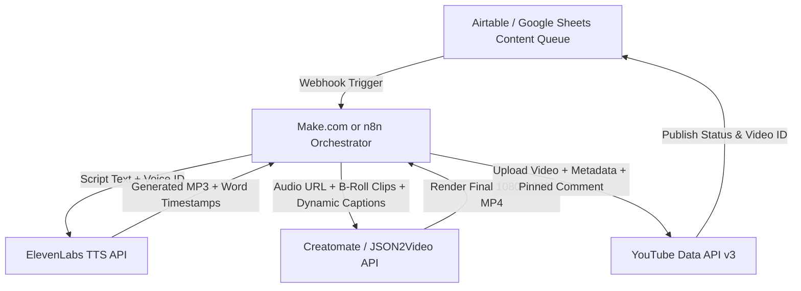

# Phase 2: Headless Automation Architecture & API Payload Specifications

## 1. System Pipeline Overview



---

## 2. Creatomate Dynamic Template Schema (JSON)

When migrating from CapCut to Creatomate, the render payload expects modular layers (Background Video, Dynamic Text Highlights, Audio Track):

```json
{
  "template_id": "sports-finance-shorts-v1",
  "modifications": {
    "Voiceover.source": "https://api.elevenlabs.io/v1/history/download/...",
    "Hook_Headline.text": "115 SUÇLAMA! ⚖️🚨",
    "Stat_Box_Value.text": "€1.350.000.000 BORÇ",
    "B_Roll_Slot_1.source": "https://storage.googleapis.com/.../stadium_aerial.mp4",
    "B_Roll_Slot_2.source": "https://storage.googleapis.com/.../contract_signing.mp4",
    "B_Roll_Slot_3.source": "https://storage.googleapis.com/.../press_conference.mp4",
    "BGM.source": "https://storage.googleapis.com/.../cinematic_tension_sub.mp3",
    "BGM.volume": "15%"
  }
}
```

---

## 3. ElevenLabs API Configuration

- **Model**: `eleven_multilingual_v2` (Seamless switching between TR and EN)
- **Voice Settings**:
  - `stability`: `0.45` (Punchy, documentary cadence with emotional urgency)
  - `similarity_boost`: `0.85`
  - `style`: `0.25`
  - `use_speaker_boost`: `true`

---

## 4. YouTube Data API v3 Upload Payload

```json
{
  "snippet": {
    "title": "Manchester City'nin 115 Suçlaması 40 Saniyede! ⚖️🚨 #shorts #mancity #futbol",
    "description": "Manchester City 115 finansal suçlama davasında neyle suçlanıyor? Naylon sponsorluklar, Roberto Mancini'nin gizli maaşı ve küme düşme tehlikesi!\n\n#mancity #premierleague #pepguardiola #futbolfinans",
    "tags": ["manchester city 115", "premier lig ceza", "pep guardiola", "futbol finansı"],
    "categoryId": "17",
    "defaultLanguage": "tr",
    "defaultAudioLanguage": "tr"
  },
  "status": {
    "privacyStatus": "public",
    "selfDeclaredMadeForKids": false
  }
}
```
